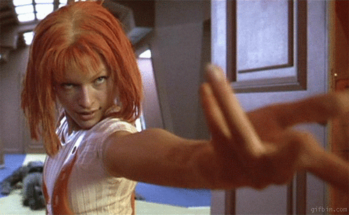
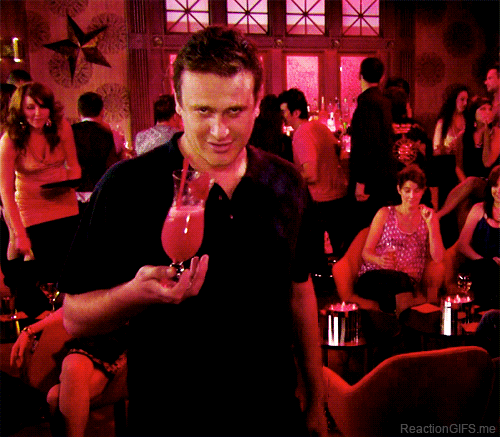

<!--
master: landing-slide
-->

<object id="logo" type="image/svg+xml" data="images/lnug-logo.svg"></object>

# 28th September 2016 (#58)

<ul class="speakers">
  <li class="speaker-card">1. Keep Calm and Curry On
<em>Andreas Møller</em></li>

  <li class="speaker-card">2. Null Can't Hurt You Anymore
<em>Stefano Vozza</em></li>

  <li class="speaker-card">3. Readable Microservices, with functional programming

<em>James Chow</em></li>

</ul>

<ul class="information">
  <li class="information-item">WIFI: See the walls!</li>
  <li class="information-item">Twitter: @LNUGorg #LNUG #nodejs </li>
  <li class="information-item">Gitter: lnug/discuss</li>
</ul>

---

<!--
master: bullet-caption-slide
-->

# Housekeeping

*  Say hello on Twiter **@LNUGOrg #LNUG** (or say hello to me too **@elibelly**!)
*  We're on YouTube: LNUG Team🎥
*  Instagram: #lnug (@lnugorg)📸
*  Gitter: **lnug/discuss** 📢
*  Toilets🚻
*  Fire Escapes!🔥
*  Code of Conduct 💕

---

<!--
master: basic-slide
-->
# Venue, drinks and pizza

#### Makers Academy

@makersacademy // makersacademy.com
# Video

@pusher // pusher.com

---
<!--
master: basic-slide
-->

# Next Up
## Andreas Møller
## Keep Calm and Curry On

Grab a drink then grab a seat!

---
<!--
master: basic-slide
-->

# Next Up
## Stefano Vozza
## Null Can't Hurt You Anymore

Grab a drink then grab a seat!

---
<!--
master: bullet-caption-slide
-->

# Community Announcements!

## Hiring? Available for Hire? Wanna share?

## Come on up!

---
<!--
master: bullet-caption-slide
-->

# Call for speakers
We have speaker slots available in 2017!
(Taking a break in December)

Visit github.com/lnug/speakers to submit your talk!

## Assets & Slides
* github.com/lnug/resources
* Gitter channel: lnug/discuss
---
<!--
master: basic-slide
-->

# Next Up
## James Chow
## Readable Microservices, with functional programming

Grab some pizza then grab a seat!

---
<!--
master: bullet-caption-slide
-->

# Thank You

## Had a great time? Let us know!
github.com/lnug/feedback

## Brought to you by...
* Makers Academy
* github.com/orgs/lnug/people

---
<!--
master: bullet-caption-slide
-->

# Until Next Time!

meetup.com/london-nodejs/

* Rubbish in Bins
* Stack chairs against walls
* Get involved!
* Afterparty 🍻

---
<!--
master: bullet-caption-slide
-->

# After Party
## The Culpeper
40 Commercial Street,
London, E1 6LP

http://theculpeper.com/pub/

@LNUGOrg #LNUG

