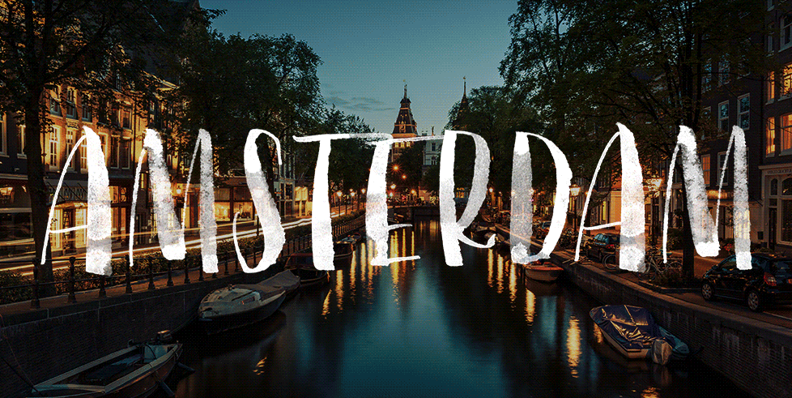

<!--
master: landing-slide
-->

<object id="logo" type="image/svg+xml" data="images/lnug-logo.svg"></object>

# 25th January 2017 (#59)

<ul class="speakers">
  <li class="speaker-card">
    Native App Tips to Save Your Sanity
    <em>Andy Trevorah</em>
  </li>

  <li class="speaker-card">
    A Year With AWS
    <em>Clarkie</em>
  </li>

  <li class="speaker-card">
    GraphQL: an API Convention That You Will Actually Follow
    <em>Cl&eacute;ment Hannicq</em>
  </li>
</ul>

<ul class="information">
  <li class="information-item">WIFI: See the walls</li>
  <li class="information-item">Twitter: @LNUGorg use hashtags #LNUG #node #javascript #london</li>
  <li class="information-item">Gitter: lnug/discuss</li>
</ul>

---

<!--
master: bullet-caption-slide
-->

# House Keeping

* Say hello on Twitter: **@lnugorg** #lnug (and me: **@claireinez**)
* YouTube: LNUG Team 🎥
* Instagram: **@lnugorg** #lnug 📷
* Gitter: **lnug/discuss** 📢
* Code of Conduct 💕
* Toilets 🚻
* Fire Escapes! 🔥

---

<!--
master: bullet-caption-slide
-->

# Freebies! ✨

## React Amsterdam (react.amsterdam)

---

<!--
master: basic-slide
-->
# Venue, drinks and pizza

# Video

---
<!--
master: basic-slide
-->

# Next Up
## Andy Trevorah
## Native App Tips to Save Your Sanity

Grab a drink then grab a seat!

---
<!--
master: basic-slide
-->

# Next Up
## Clarkie
## A Year with AWS

Grab a drink then grab a seat!

---
<!--
master: bullet-caption-slide
-->

# Community Announcements
Who? What? Contact details?

## Hiring?

## Available for hire?

## Have something to share?

---
<!--
master: bullet-caption-slide
-->

# Get involved!

## Assets & Slides
* github.com/lnug/resources

## Website Tips
* github.com/lnug/lnug.github.io

## Gitter Channel
* lnug/discuss

---
<!--
master: bullet-caption-slide
-->

# Call for speakers

## We have speaker slots available!

## Visit github.com/lnug/speakers to submit your talk!

---
<!--
master: bullet-caption-slide
-->

# Next Time
## 22nd February 2017

The 4th Wednesday of the month

meetup.com/london-nodejs/

* Rubbish in Bins
* Stack chairs against walls
* Get involved!

---
<!--
master: bullet-caption-slide
-->

# After Party

## The Culpeper

40 Commercial Street,
London,
E1 6LP

http://theculpeper.com/pub/

---
<!--
master: basic-slide
-->

# Next Up
## Cl&eacute;ment Hannicq
## GraphQL: an API Convention That You Will Actually Follow

Grab some pizza then grab a seat!

---
<!--
master: bullet-caption-slide
-->

# Thank You

## Had a great time? Let us know!
github.com/lnug/feedback

## Brought to you by...
* Makers Academy
* github.com/orgs/lnug/people
