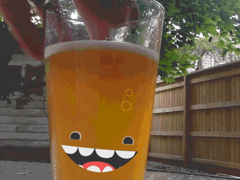

<!--
master: landing-slide
-->

<object id="logo" type="image/svg+xml" data="images/lnug-logo.svg"></object>

# 22nd March 2017 (#61)

<ul class="speakers">
  <li class="speaker-card">
    Fullstack integration testing that doesn't suck
    <em>- Artem Avetisyan</em>
  </li>

  <li class="speaker-card">
    Our future is in little hands
    <em>- Tony Yates</em>
  </li>

  <li class="speaker-card">
    'Minecraft' in VR in 30 lines of Javascript
    <em>- James Porter</em>
  </li>
</ul>

<ul class="information">
  <li class="information-item">WIFI: See the walls</li>
  <li class="information-item">Twitter: @LNUGorg use hashtags #LNUG #node #javascript #london</li>
  <li class="information-item">Gitter: lnug/discuss</li>
</ul>

---

<!--
master: bullet-caption-slide
-->

# House Keeping

* Say hello on Twitter: **@lnugorg** #lnug (and me: **@lazlojuly**)
* YouTube: LNUG Team 🎥
* Instagram: **@lnugorg** #lnug 📷
* Gitter: **lnug/discuss** 📢
* Code of Conduct 💕
* Toilets 🚻
* Fire Escapes! 🔥

---

<!--
master: basic-slide
-->
# Venue

---

<!--
master: basic-slide
-->
# Pizza and beer

---

<!--
master: basic-slide
-->
# Video

---

<!--
master: basic-slide
-->

# Next Up
## Artem Avetisyan
## Fullstack integration testing that doesn't suck

Grab a drink & pizza then grab a seat!

---
<!--
master: basic-slide
-->

# Next Up
## Tony Yates
## Our future is in little hands

Grab a drink then grab a seat!

---
<!--
master: bullet-caption-slide
-->

# Community Announcements
Who? What? Contact details?

## Hiring?

## Available for hire?

## Have something to share?

---
<!--
master: bullet-caption-slide
-->

# Get involved!

## Assets & Slides
* github.com/lnug/resources

## Website Tips
* github.com/lnug/lnug.github.io

## Gitter Channel
* lnug/discuss

---
<!--
master: bullet-caption-slide
-->

# Call for speakers

## We have speaker slots available!

## Visit github.com/lnug/speakers to submit your talk!

---
<!--
master: bullet-caption-slide
-->

# Next Time
## 26th April 2017

The 4th Wednesday of the month

meetup.com/london-nodejs/

* Rubbish in Bins
* Stack chairs against walls
* Get involved!

---
<!--
master: bullet-caption-slide
-->

# After Party

## The Culpeper

40 Commercial Street,
London,
E1 6LP

http://theculpeper.com/pub/

---
<!--
master: basic-slide
-->

# Next Up
## James Porter
## 'Minecraft' in VR in 30 lines of Javascript

Grab some pizza then grab a seat!

---
<!--
master: bullet-caption-slide
-->

# Thank You

## Had a great time? Let us know!
github.com/lnug/feedback

## Brought to you by...
* Makers Academy
* Tiro Partners
* github.com/orgs/lnug/people
